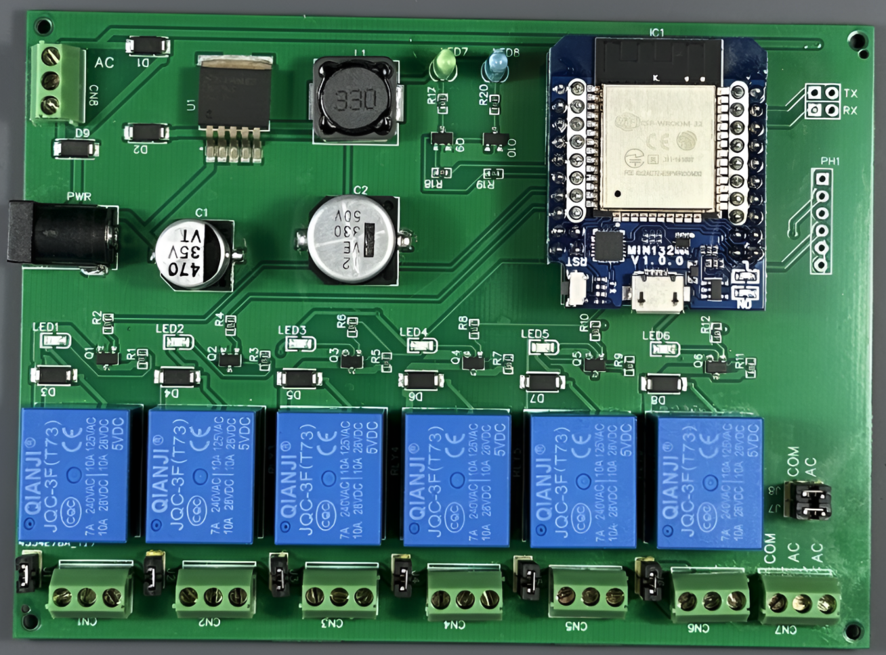

# WeMos D1 Mini ESP32 Relay Board
This WeMos D1 Mini ESP32 Relay Board features 8 channels and is compatible with both 24V AC and 5V DC power sources. Specifically designed as a seamless replacement for sprinkler controller systems, this board offers straightforward configurability using jumpers. These jumpers provide the flexibility to set it up as either standalone relays or common input relays, making it an adaptable solution for various applications.

# BOM

|Line|Name               |Designator                     |Footprint                           |Quantity|
|----|-------------------|-------------------------------|------------------------------------|--------|
|1   |470uF              |C1                             |CAP-SMD_BD10.0-L10.3-W10.3-LS11.3-FD|1       |
|2   |330uF              |C2                             |CAP-SMD_BD12.5-L13.0-W13.0-LS13.7-FD|1       |
|3   |1X3                |CN1,CN2,CN3,CN4,CN5,CN6,CN7,CN8|TERMINAL-BLOCK 3.5X3                |8       |
|4   |SS24               |D1,D2,D9                       |SMA_L4.3-W2.6-LS5.2-RD              |3       |
|5   |DIODE              |D3,D4,D5,D6,D7,D8              |DO-214AC_L4.3-W2.7-LS5.3-RD         |6       |
|6   |WEMOS-D1-MINI-ESP32|IC1                            |WEMOS-D1-MINI-ESP32                 |1       |
|7   |Jumper             |J1,J2,J3,J4,J5,J6,J7,J8,RX,TX  |HDR-TH_2P-P2.54-V-M-1               |10      |
|8   |33uH               |L1                             |IND-SMD_L12.3-W12.3                 |1       |
|9   |17-21SUYC/TR8      |LED1,LED2,LED3,LED4,LED5,LED6  |LED0805-R-RD                        |6       |
|10  |LED-TH             |LED7,LED8                      |LED-TH_BD3.0_RED                    |2       |
|11  |Header 6x1         |PH1                            |PINHEADER_06X1                      |1       |
|12  |POWER-JACK         |PWR                            |DC-IN-TH_POWER-JACK                 |1       |
|13  |AO3400A            |Q1,Q2,Q3,Q4,Q5,Q6,Q9,Q10       |SOT-23-3_L2.9-W1.6-P1.90-LS2.8-BR   |8       |
|14  |470                |R1                             |R0603                               |1       |
|15  |470Ω               |R2,R4,R6,R8,R10,R12,R18,R19    |R0603                               |8       |
|16  |470                |R3,R5,R7,R9,R11,R17,R20        |R0603                               |7       |
|17  |5V RELAY           |RLY1,RLY2,RLY3,RLY4,RLY5,RLY6  |RELAY-TH_RELAY-SPST                 |6       |
|18  |LM2596SX-5.0/NOPB  |U1                             |TO-263-5_L10.2-W8.9-P1.70-TL        |1       |

# Schematics

# Links:

Open Source Hardware Lap project: https://oshwlab.com/fellowgeek/esp-relay-board